# Guia completo de Argo CD com Helm: AppProjects, Applications e Chart.yaml

Se você está começando com **Argo CD** e **GitOps**, provavelmente já percebeu que gerenciar várias aplicações e projetos manualmente pode ser complicado.
Neste guia, vamos mostrar como usar **Helm** para criar **AppProjects** e **Applications** de forma automática, padronizada e escalável, e como o `Chart.yaml` organiza seu chart.

---

## 1. Helm Chart.yaml: o coração do chart

O `Chart.yaml` é o arquivo principal de qualquer chart Helm. Ele define **informações básicas sobre o chart** e a aplicação que ele deploya.

Exemplo de `Chart.yaml`:

```yaml
apiVersion: v2
name: applications
description: Applications

type: application
version: 0.1.0
appVersion: "1.0"
```

* **apiVersion: v2** → Define que é um chart Helm versão 2.
* **name** → Nome do chart, usado para referenciar o pacote.
* **description** → Breve descrição do chart.
* **type** → Pode ser:

  * `application` → chart que gera templates para deploy de apps.
  * `library` → chart que fornece funções/utilitários para outros charts (não gera templates de deploy).
* **version** → Versão do chart, deve seguir [Semantic Versioning](https://semver.org/). Incrementa sempre que você muda templates ou configurações do chart.
* **appVersion** → Versão da aplicação que está sendo deployada pelo chart (não precisa seguir Semantic Versioning).

> Esse arquivo serve como referência central do Helm e ajuda a versionar tanto o chart quanto a aplicação que ele deploya.

---

## 2. AppProjects: organizando suas aplicações

Um **AppProject** funciona como um “container de aplicações” dentro do Argo CD. Ele permite:

* Agrupar várias aplicações (`Applications`) sob um mesmo projeto.
* Controlar **repositórios**, **clusters** e **namespaces** permitidos.
* Definir **permissões** através de roles e policies.
* Restringir recursos que podem ser manipulados.

### Diagrama do fluxo de AppProject


### Exemplo de template Helm para AppProject

```yaml
apiVersion: argoproj.io/v1alpha1
kind: AppProject
metadata:
  name: {{ .Values.project.name }}
  namespace: {{ .Values.argocd.namespace }}
  finalizers:
    - resources-finalizer.argocd.argoproj.io
spec:
  description: "{{ .Values.project.description | default "Projects apps cluster" }}"
  sourceRepos:
    {{- range .Values.project.sourceRepos }}
    - "{{ . }}"
    {{- end }}
  destinations:
    {{- range .Values.project.destinations }}
    - namespace: "{{ .namespace }}"
      server: "{{ .server }}"
    {{- end }}
  clusterResourceWhitelist:
    {{- range .Values.project.clusterResourceWhitelist }}
    - group: "{{ .group }}"
      kind: "{{ .kind }}"
    {{- end }}
  namespaceResourceBlacklist:
    {{- range .Values.project.namespaceResourceBlacklist }}
    - group: "{{ .group }}"
      kind: "{{ .kind }}"
    {{- end }}
  namespaceResourceWhitelist:
    {{- range .Values.project.namespaceResourceWhitelist }}
    - group: "{{ .group }}"
      kind: "{{ .kind }}"
    {{- end }}
  roles:
    {{- range .Values.project.roles }}
    - name: "{{ .name }}"
      description: "{{ .description | default "No description provided" }}"
      policies:
        {{- range .policies }}
        - "{{ . }}"
        {{- end }}
      groups:
        {{- range .groups }}
        - "{{ . }}"
        {{- end }}
      jwtTokens:
        {{- range .jwtTokens }}
        - iat: {{ .iat }}
        {{- end }}
    {{- end }}
```

### Exemplo de `values.yaml` para AppProject

```yaml
argocd:
  namespace: argocd

project:
  name: meu-projeto
  description: Projeto de apps de teste
  sourceRepos:
    - https://github.com/meu-org/*
  destinations:
    - namespace: app-namespace
      server: https://kubernetes.default.svc
  clusterResourceWhitelist:
    - group: ""
      kind: ConfigMap
  namespaceResourceBlacklist:
    - group: ""
      kind: Secret
  namespaceResourceWhitelist:
    - group: ""
      kind: Deployment
  roles:
    - name: devs
      description: Acesso para equipe de desenvolvimento
      policies:
        - "p, proj:meu-projeto:devs, applications, *, meu-projeto/*, allow"
      groups:
        - developers
```

---

## 3. Applications: declarando suas aplicações

Um **Application** no Argo CD define:

* De qual repositório Git buscar os manifests.
* Em qual cluster e namespace aplicar.
* Como sincronizar as alterações.

### Diagrama do fluxo de Applications

```mermaid
graph LR
A[Application] --> B[Repositório Git]
A --> C[Cluster de destino]
A --> D[Namespace de destino]
A --> E[SyncPolicy]
```



### Template Helm para Applications

```yaml
{{- $root := . -}}
{{- range $i, $app := .Values.applications }}
apiVersion: argoproj.io/v1alpha1
kind: Application
metadata:
  name: {{ $app.name | quote }}
  namespace: {{ $root.Values.argocd.namespace | quote }}
  {{- with $app.labels }}
  labels:
{{ toYaml . | nindent 4 }}
  {{- end }}
  {{- $finalizers := (default (list "resources-finalizer.argocd.argoproj.io") $app.finalizers) }}
  {{- if $finalizers }}
  finalizers:
  {{- range $finalizers }}
    - {{ . }}
  {{- end }}
  {{- end }}
  {{- with $app.annotations }}
  annotations:
{{ toYaml . | nindent 4 }}
  {{- end }}
spec:
  {{- if $app.spec }}
{{ toYaml $app.spec | nindent 2 }}
  {{- else }}
  project: {{ default "default" $app.project | quote }}
  destination:
    server: {{ $app.destinationServer | quote }}
    {{- if $app.destinationNamespace }}
    namespace: {{ $app.destinationNamespace | quote }}
    {{- end }}
  {{- if $app.sources }}
  sources:
{{ toYaml $app.sources | nindent 4 }}
  {{- else }}
  {{- if $app.source }}
  source:
{{ toYaml $app.source | nindent 4 }}
  {{- else }}
  source:
    repoURL: {{ $app.repoURL | quote }}
    path: {{ $app.path | quote }}
    targetRevision: {{ default "HEAD" $app.targetRevision | quote }}
  {{- end }}
  {{- end }}
  {{- with $app.syncPolicy }}
  syncPolicy:
{{ toYaml . | nindent 4 }}
  {{- end }}
  {{- with $app.ignoreDifferences }}
  ignoreDifferences:
{{ toYaml . | nindent 4 }}
  {{- end }}
  {{- with $app.info }}
  info:
{{ toYaml . | nindent 4 }}
  {{- end }}
  {{- with $app.revisionHistoryLimit }}
  revisionHistoryLimit: {{ . }}
  {{- end }}
  {{- end }}
---
{{- end }}
```

### Exemplo de `values.yaml` para Applications

```yaml
argocd:
  namespace: argocd

applications:
  - name: minha-app
    project: meu-projeto
    destinationServer: https://kubernetes.default.svc
    destinationNamespace: app-namespace
    repoURL: https://github.com/meu-org/minha-app.git
    path: deploy
    targetRevision: main
    syncPolicy:
      automated: {}
```

---

## 4. Benefícios de usar Helm com Argo CD

* **Escalabilidade**: adiciona novos projetos e aplicações sem duplicar YAML.
* **Padronização**: todos os recursos seguem a mesma estrutura.
* **Segurança**: controla repositórios, clusters, namespaces e recursos permitidos.
* **Controle de acesso**: roles e policies definem permissões de forma centralizada.
* **Facilidade de manutenção**: basta atualizar o `values.yaml` para refletir mudanças.
* **Versionamento**: o `Chart.yaml` ajuda a versionar o chart e a aplicação separadamente.

---

## 5. Resumo

Com esse conjunto de templates e o `Chart.yaml`:

1. Você organiza **AppProjects** para agrupar aplicações e definir permissões.
2. Cria **Applications** de forma padronizada, declarativa e escalável.
3. Versiona seu chart e sua aplicação com `Chart.yaml`.
4. Mantém segurança, controle de acesso e facilidade de manutenção.

A combinação **Helm + Argo CD** é ideal para equipes que usam GitOps em Kubernetes, permitindo **automatização, padronização e escalabilidade** de maneira confiável.


# Gerenciamento Declarativo de Recursos de Cluster com Kustomize e Argo CD

Quando usamos **GitOps** em Kubernetes/OpenShift, nem só as aplicações precisam de deploy automatizado.
Também é necessário gerenciar recursos de **cluster**, como autenticação, permissões e configurações críticas, de forma **declarativa e auditável**.

Neste guia, explicaremos a técnica utilizada para fazer isso de maneira robusta e replicável, usando **Kustomize** junto com **Helm e Argo CD**.

---

## 1. Conceito central: GitOps para recursos de cluster

A ideia é manter **todos os recursos do cluster versionados no Git**, aplicados automaticamente pelo Argo CD:

* **Aplicações** → Helm templates + AppProjects + Applications
* **Configurações de cluster** → Kustomize overlays + patches + generators

> Com isso, tudo que é aplicado no cluster tem um histórico completo no Git, garantindo auditabilidade e consistência.

---

## 2. Estrutura Kustomize

O Kustomize permite organizar recursos e aplicar **overlays e patches**, sem duplicar YAML.

Exemplo de base + overlay:

```yaml
apiVersion: kustomize.config.k8s.io/v1beta1
kind: Kustomization

resources:
  - ../../../components/oauth/overlays/htpass
```

* **resources** → aponta para outros diretórios ou arquivos YAML base.
* Cada overlay pode adicionar, modificar ou remover recursos.
* Isso permite ter diferentes configurações para `dev`, `homolog` e `prod`.

---

## 3. Patches e transformações

Kustomize usa **patches** para modificar recursos existentes de forma declarativa.

Exemplo genérico de patch:

```yaml
patches:
  - path: oauth-htpass-patch.yaml
    target:
      group: config.openshift.io
      kind: OAuth
      name: cluster
      version: v1
- op: add
  path: /spec/identityProviders/-
  value:
    name: Local
    mappingMethod: claim
    type: HTPasswd
    htpasswd:
      fileData:
        name: htpass-secret
```

* `target` → define qual recurso será alterado.
* `op` e `path` → operação de patch no YAML original.
* `value` → o conteúdo que será adicionado ou modificado.

> Técnica aplicável para qualquer recurso: OAuth, CRDs, ClusterRoleBindings, ConfigMaps, Secrets, etc.

---

## 4. SecretGenerator e ConfigMapGenerator

Quando precisamos gerar Secrets ou ConfigMaps dinamicamente:

```yaml
generatorOptions:
  disableNameSuffixHash: true

secretGenerator:
  - files:
      - htpasswd=files/users.htpasswd
    name: htpass-secret
    namespace: openshift-config
    type: Opaque

configMapGenerator:
  - files:
      - ca.crt=files/ldap-ca.crt
    name: ca-ldap
    namespace: openshift-config
```

* **SecretGenerator** → cria Secrets a partir de arquivos ou literais.
* **ConfigMapGenerator** → cria ConfigMaps a partir de arquivos.
* **disableNameSuffixHash** → mantém nomes consistentes, útil para patches e referências externas.

> Técnica geral: qualquer arquivo necessário para configuração do cluster pode ser versionado e transformado em Secret ou ConfigMap via Kustomize.

---

## 5. ClusterRoleBindings e permissões

Recursos como **ClusterRoleBinding** podem ser declarados e aplicados via GitOps:

```yaml
apiVersion: rbac.authorization.k8s.io/v1
kind: ClusterRoleBinding
metadata:
  name: cluster-admin-0
roleRef:
  apiGroup: rbac.authorization.k8s.io
  kind: ClusterRole
  name: cluster-admin
subjects:
  - apiGroup: rbac.authorization.k8s.io
    kind: User
    name: admin
```

* Técnica: manter permissões críticas versionadas no Git.
* Pode ser aplicada junto com patch generators, garantindo consistência entre clusters.

---

## 6. Multi-identity provider (HTPasswd + LDAP)

A técnica de patches permite adicionar múltiplos identity providers:

```yaml
- op: add
  path: /spec/identityProviders/-
  value:
    name: LDAP LAB
    mappingMethod: claim
    type: LDAP
    ldap:
      attributes:
        id: [sAMAccountName]
        email: [mail]
        name: [cn]
        preferredUsername: [sAMAccountName]
      bindDN: 'CN=ldap-reader,OU=Service Accounts,DC=lab,DC=corp'
      bindPassword:
        name: ldap-secret
      ca:
        name: ca-ldap
      insecure: false
      url: 'ldaps://ad.lab.corp:636/DC=lab,DC=corp?sAMAccountName?sub?(objectClass=person)'
```

* Técnica reutiliza **patch + Secret + ConfigMap**.
* Pode ser combinada com HTPasswd ou outros identity providers.
* Permite manter configuração do cluster **totalmente declarativa**.

---

## 7. Integração com Argo CD e Helm

Fluxo completo:

1. **Helm** → gera templates de Apps (AppProjects + Applications)
2. **Kustomize** → monta overlays e aplica patches nos recursos de cluster
3. **Argo CD** → aplica tudo de forma declarativa, garantindo GitOps
4. **Anotações Argo CD** → `IgnoreExtraneous` ou `Prune=false` evitam conflitos com recursos gerenciados nativamente pelo OpenShift


---

## 8. Benefícios da técnica

* Permite **gerenciar recursos de cluster** e aplicações com GitOps.
* Facilita **replicação entre ambientes** (dev, staging, prod).
* Mantém **histórico completo de alterações** no Git.
* Técnica genérica: aplica-se a **HTPasswd, LDAP, CRDs, RBAC, ConfigMaps, Secrets**.
* Reduz erros de configuração manual e garante **consistência declarativa**.

---

## 9. Resumo

Essa abordagem permite que tanto aplicações quanto recursos críticos de cluster sejam:

* Versionados no Git
* Aplicados declarativamente via Argo CD
* Configurados e transformados de forma reutilizável com Kustomize

> Resumindo: o uso de **patches, generators e overlays** é a técnica principal para gerenciar recursos de cluster de forma declarativa e escalável.

# Estrutura GitOps com Apps of Apps e Overlays por Ambiente

```mermaid
graph TD
    %% =====================
    %% GIT REPOSITORY
    %% =====================
    subgraph Git[📂 Git Repository]
        direction TB

        subgraph HelmCharts[📦 Helm Charts]
            ApplicationsHelm[applications/ (AppProjects + Applications)]
            ProjectsHelm[projects/ (AppProject definitions)]
        end

        subgraph KustomizeOverlays[🛠️ Kustomize Overlays]
            Base[base/ (Recursos comuns: OAuth, RBAC, Configs)]
            Dev[overlays/dev/]
            Staging[overlays/staging/]
            Prod[overlays/prod/]
        end
    end

    %% =====================
    %% ARGO CD
    %% =====================
    subgraph ArgoCD[🚀 Argo CD]
        direction TB
        RootApp[Root Application (App of Apps)]
        AppProjects[AppProjects]
        ChildApps[Applications]
        ClusterConfigs[Cluster Resources (via Kustomize)]
    end

    %% =====================
    %% CLUSTER
    %% =====================
    subgraph Cluster[☸️ Kubernetes/OpenShift Cluster]
        direction TB
        Apps[Aplicações em Namespaces]
        OAuth[OAuth Identity Providers (HTPasswd / LDAP)]
        RBAC[ClusterRoleBindings & Roles]
        Secrets[Secrets & ConfigMaps]
        Namespaces[Namespaces de destino]
    end

    %% =====================
    %% CONNECTIONS
    %% =====================
    Git --> RootApp
    ApplicationsHelm --> RootApp
    ProjectsHelm --> AppProjects

    RootApp --> AppProjects
    RootApp --> ChildApps
    RootApp --> ClusterConfigs

    KustomizeOverlays --> ClusterConfigs
    Base --> Dev
    Base --> Staging
    Base --> Prod

    ChildApps --> Apps
    ClusterConfigs --> OAuth
    ClusterConfigs --> RBAC
    ClusterConfigs --> Secrets
    ClusterConfigs --> Namespaces


